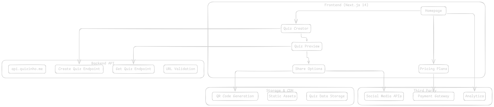
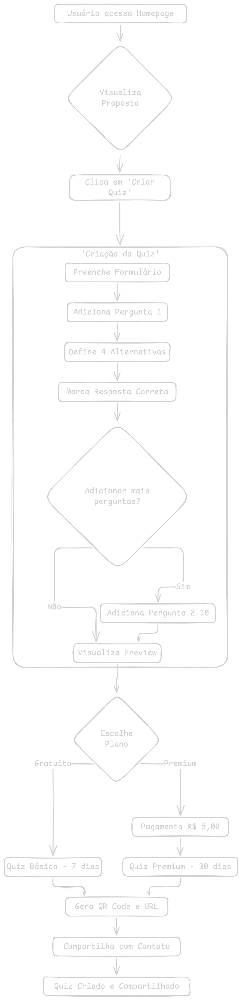
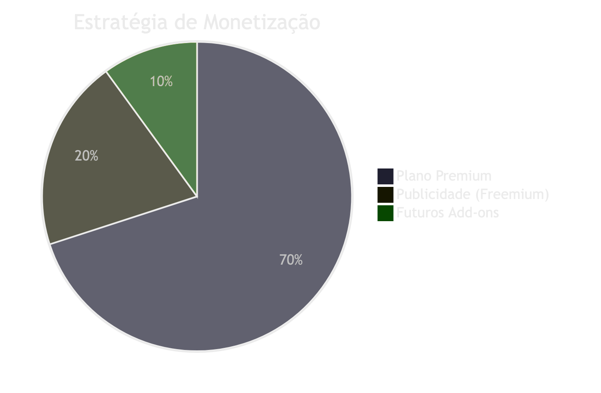
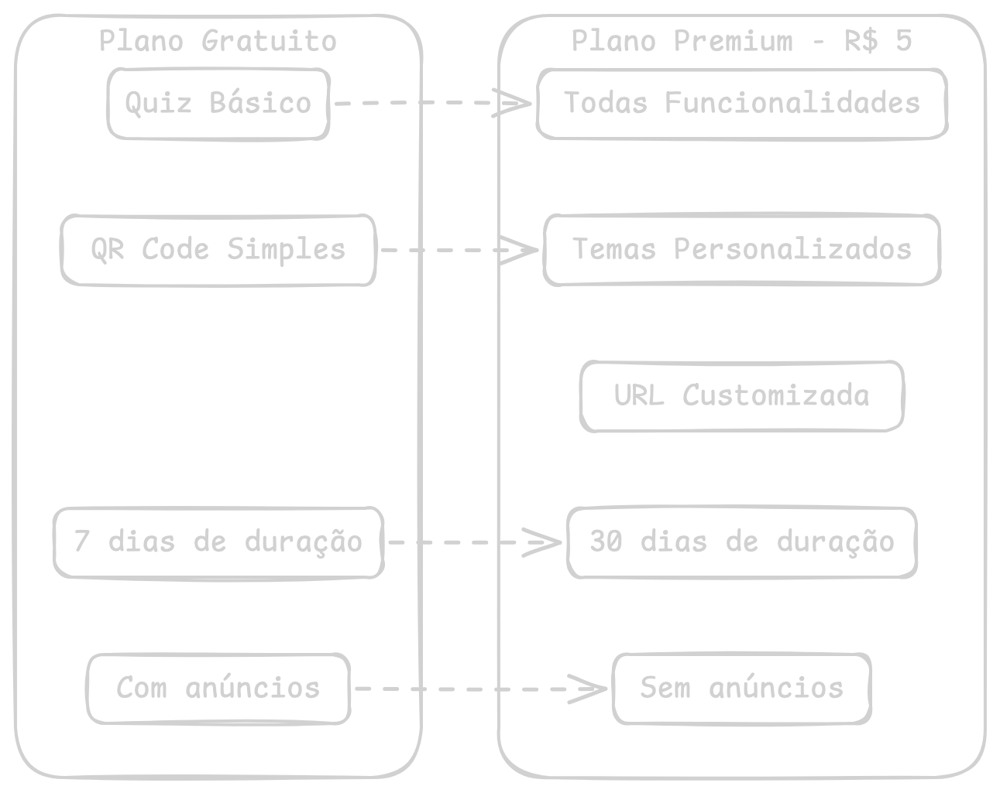
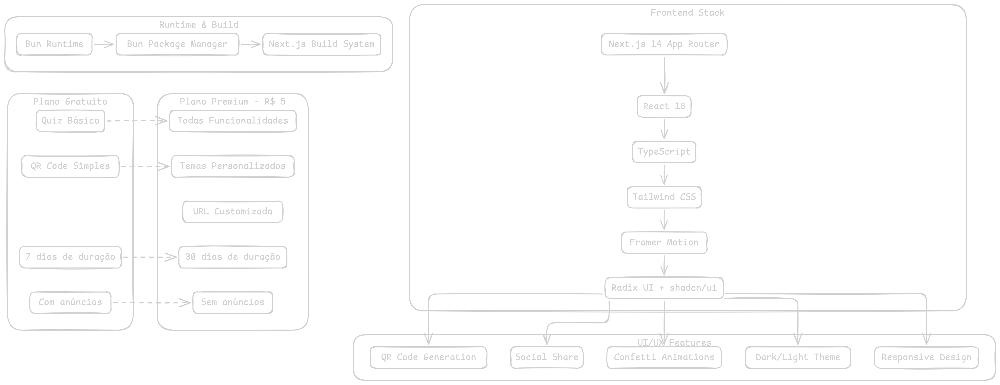
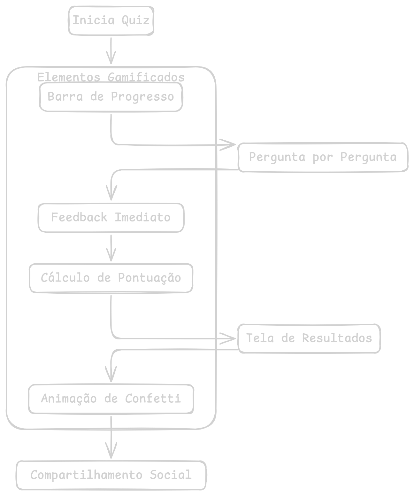
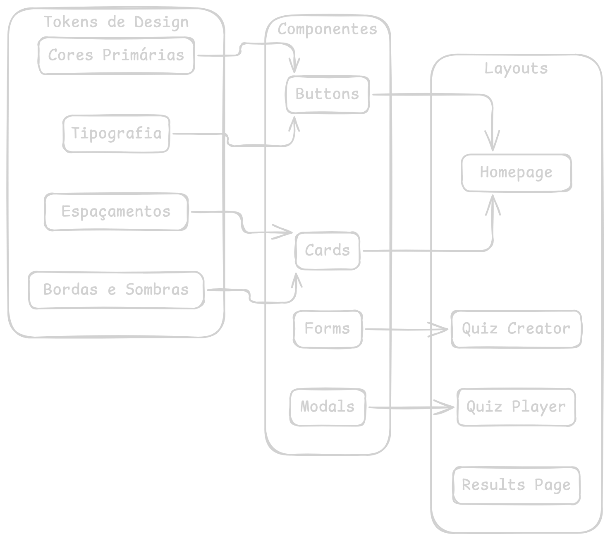
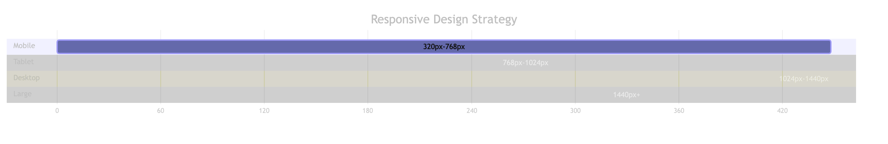
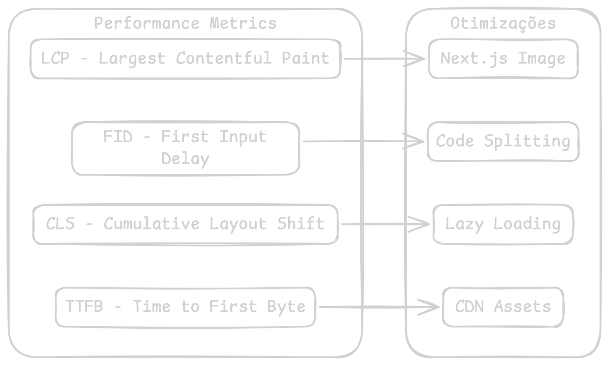

# Estudo de Caso: Quizinho - Plataforma de Quizzes Personalizados

## 📋 Resumo Executivo

**Quizinho** é uma plataforma SaaS que permite criar quizzes personalizados e divertidos para compartilhar com pessoas próximas. Focado especialmente em relacionamentos amorosos, o produto oferece uma experiência gamificada de conexão através de perguntas personalizadas.

### Modelo de Negócio
- **Freemium**: Funcionalidades básicas gratuitas
- **Premium**: R$ 5,00 para recursos avançados
- **Target**: Casais, amigos e famílias que querem se conectar de forma divertida

---

## 🏗️ Arquitetura do Sistema

---

## 🔄 Fluxo do Usuário Principal

---

## 🎯 Jornada do Usuário Respondente

---

## 💰 Análise do Modelo de Negócio

### Comparativo de Planos

---

## 🛠️ Stack Tecnológico

---

## 🔍 Análise de Funcionalidades

### Sistema de Gamificação

---

## 📱 Análise de UX/UI

### Design System

### Responsive Breakpoints

---

## 🚀 Análise de Performance

### Core Web Vitals

---

## 💡 Insights e Oportunidades

### Pontos Fortes
- ✅ **Simplicidade**: UX intuitiva e fácil de usar
- ✅ **Modelo Freemium**: Baixa barreira de entrada
- ✅ **Viral**: Alto potencial de compartilhamento
- ✅ **Stack Moderna**: Tecnologias atuais e performáticas

### Oportunidades de Crescimento
- 🎯 **Templates**: Quizzes prontos por categoria
- 🎯 **Gamificação**: Sistema de pontos e rankings
- 🎯 **Integração**: APIs de redes sociais
- 🎯 **Analytics**: Dashboard para criadores